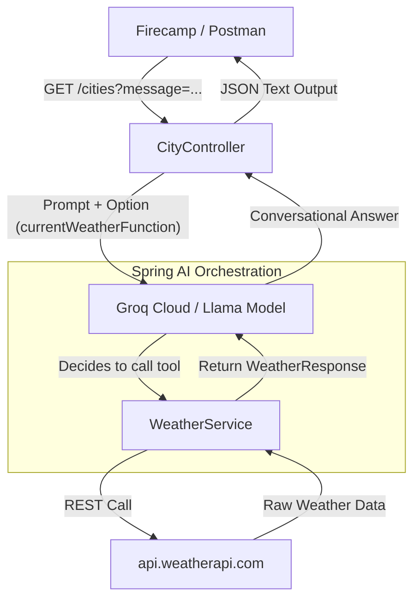

# 🌦️ Spring AI Function Calling Service


This project demonstrates how to implement **Function Calling (Tool Calling)** in a Spring Boot application using **Spring AI** and **Groq Cloud** (specifically with the Llama models). It allows the AI model to dynamically trigger a local Java function (`WeatherService`) to fetch real-time weather information instead of relying solely on its static training data.

---

## 🏗️ Project Flow & Architecture

The following diagram illustrates how the `CityController`, `FunctionConfiguration`, and `WeatherService` collaborate with Spring AI and the external Weather API:



## 🌟 Key Features
* **Spring AI Tool Binding**: Uses stable Spring AI milestone configurations (v1.0.0-M2) to register local Java functions as tools for the LLM.

* **Groq Cloud Integration**: Leverages high-performance Llama models via Groq's fast inference engine.

* **Environment Security**: Uses dotenv-java to load secret API keys from a localized .env file, keeping them safe from version control.

* **Strongly-Typed Domain**: Built entirely using modern Java record types for handling API request/response payloads.

## 🛠️ Prerequisites
* Java 21 (OpenJDK) or later

* Maven 4.0.0+

* A valid Groq Cloud API Key (from Groq Console)

* A valid Weather API Key from api.weatherapi.com

 ## 🚀 Installation & Quick Start
1. Clone the Repository
```bash
git clone <your-github-repo-url>
cd spring-ai-function-calling

```

2. Configure Environment Variables (.env)
Create a .env file directly at the root folder path (where your pom.xml resides):

```Code snippet
GROQ_API_KEY=gsk_your_actual_groq_api_key_here
WEATHER_API_KEY=your_actual_weather_api_key_hereGROQ_API_KEY=gsk_your_actual_groq_api_key_here
WEATHER_API_KEY=your_actual_weather_api_key_here
```
3. Application Properties Setup
Your src/main/resources/application.properties extracts the setup injection securely:
```Properties
spring.ai.openai.api-key=${GROQ_API_KEY}
weather.apiKey=${WEATHER_API_KEY}

spring.ai.openai.base-url=[https://api.groq.com/openai](https://api.groq.com/openai)
spring.ai.openai.chat.options.model=llama-3.3-70b-specdec
weather.apiUrl=[https://api.weatherapi.com/v1](https://api.weatherapi.com/v1)
```

4. Build and Run
```Bash
mvn clean compile
mvn spring-boot:run
```
## 📡 API Testing & Sample Output
* Endpoint: GET http://localhost:8000/cities

* Query Parameter: message (e.g., How is the weather in Mandalay?)

 ** Firecamp / Postman Response **
 ```Plaintext
"The current weather in Mandalay is partly cloudy with 26.4°C."
```
## 🧪 Automated Testing
Run pre-configured unit test cases mapped out via Mockito slices to mock remote server calls:
```Bash
mvn test
```

